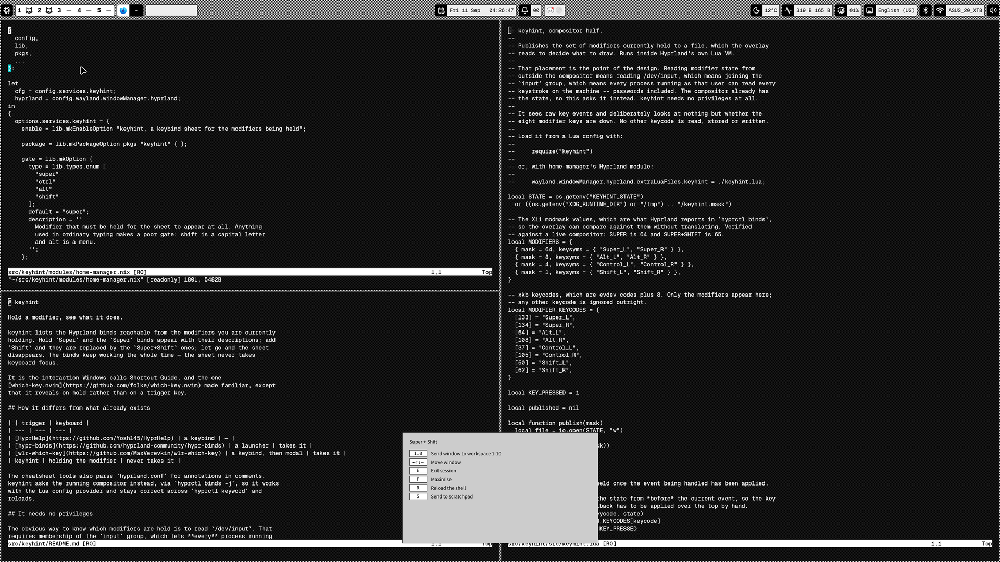

# hyprkeyhint — which-key for Hyprland

Hold a modifier and see every keybind it reaches. Let go and it disappears.


Hold `Super` and the sheet lists the `Super` binds with their descriptions. Add
`Shift` and it swaps to the `Super+Shift` layer. The sheet never takes keyboard
focus, so the binds keep working while you read them.



Runs of similar binds are folded into one line, so ten workspace binds read as
`1…0  Workspace 1-10` instead of filling the sheet. The footer names the other
layers and how many binds each one holds.

## Requirements

- **Hyprland with the Lua config provider.** The compositor half is a Lua file
  that Hyprland loads. Tested on 0.56.2; it needs `hl.on` and
  `hl.is_key_down`, so a `hyprland.conf` setup will not work.
- **`hyprctl` on `PATH`** at runtime. hyprkeyhint reads the bind list from the
  running compositor rather than from a config file.
- **Binds that carry descriptions.** A bind without one is skipped. See
  [Describing your binds](#describing-your-binds).

GTK 4 and the layer-shell library come with the package.

## Install

### Flake with home-manager

```nix
{
  inputs.hyprkeyhint.url = "github:R3D2/hyprkeyhint";
}
```

Then in your home-manager configuration:

```nix
{
  imports = [ inputs.hyprkeyhint.homeModules.default ];
  nixpkgs.overlays = [ inputs.hyprkeyhint.overlays.default ];

  services.hyprkeyhint.enable = true;
}
```

That installs the package, loads the Lua half through
`wayland.windowManager.hyprland.extraLuaFiles`, and starts a user service with
your graphical session. The module takes its default package from
`pkgs.hyprkeyhint`, so either apply the overlay or set `services.hyprkeyhint.package`.

### Flake, package only

```
nix run github:R3D2/hyprkeyhint
```

You still have to load the Lua half, as below.

### Without flakes

Build it:

```
nix-build -E 'with import <nixpkgs> {}; callPackage ./package.nix {}'
```

Copy the Lua half next to your Hyprland config and load it:

```
install -Dm644 result/share/hyprkeyhint/hyprkeyhint.lua ~/.config/hypr/hyprkeyhint.lua
```

```lua
-- in ~/.config/hypr/hyprland.lua
require("hyprkeyhint")
```

Then run `result/bin/hyprkeyhint` from your session. A user unit is the tidy way:

```ini
[Unit]
Description=Keybind sheet for the modifiers being held
PartOf=graphical-session.target
After=graphical-session.target
ConditionEnvironment=WAYLAND_DISPLAY

[Service]
ExecStart=/path/to/result/bin/hyprkeyhint --anchor=bottom
Restart=on-failure

[Install]
WantedBy=graphical-session.target
```

## Describing your binds

hyprkeyhint shows a bind only if it carries a description, because a dispatcher and
its arguments do not explain anything:

```lua
hl.bind("SUPER + Return", hl.dsp.exec_cmd("kitty"), { description = "Terminal" })
```

Hyprland hands that text back through `hyprctl binds -j`, which is where
hyprkeyhint reads it. Nothing parses your config file.

## Checking it works

Hold `Super` for a second. If no sheet appears:

```
# Is the drawing half running?
systemctl --user status hyprkeyhint

# Is the compositor half publishing? This changes while you hold Super.
watch -n0.2 cat "$XDG_RUNTIME_DIR/hyprkeyhint.mask"

# Do your binds have descriptions? Zero here means the sheet has nothing to
# show, and it will say "nothing bound".
hyprctl binds -j | grep -c '"has_description": true'
```

A mask stuck at `0` means `require("hyprkeyhint")` never ran. Check that
`hyprkeyhint.lua` is in `~/.config/hypr/` and that your config loads it.

## Options

Every option maps to a command-line flag, so `hyprkeyhint --help` covers the
standalone case too.

| Option | Default | Meaning |
| --- | --- | --- |
| `gate` | `super` | modifier that must be held for the sheet to appear |
| `delay` | `200` | milliseconds to hold before it appears |
| `rowsPerColumn` | `13` | maximum rows in a column before it wraps |
| `anchor` | `center` | `center`, `top` or `bottom` |
| `margin` | `48` | pixels from the anchored edge |
| `opacity` | `1.0` | opacity of the sheet, 0.0 to 1.0 |
| `fold` | `true` | fold runs of similar binds into one row |
| `style` | `""` | CSS appended to the built-in stylesheet |
| `extraArgs` | `[ ]` | extra command-line arguments |

Set `anchor = "bottom"` if you also hold the gate modifier to drag windows. A
centred sheet lands on top of whatever you are dragging.

### Folding

Ten binds that say `Workspace 1` through `Workspace 10` take ten rows to say
one thing. Runs of three or more are folded into a single row: `1…0` for a
numbered run, `←↑↓→` for the four directions. A run is detected by a
description ending in a number or a direction word.

The folded row implies that `0` is workspace 10 rather than stating it, so set
`fold = false` for the unabridged list.

### Styling

`style` is appended to the built-in stylesheet. The classes are
`hyprkeyhint-sheet`, `hyprkeyhint-title`, `hyprkeyhint-key`, `hyprkeyhint-description`,
`hyprkeyhint-footer` and `hyprkeyhint-empty`.

```nix
services.hyprkeyhint.style = ''
  .hyprkeyhint-sheet { background: #1c1c2c; border-color: #78a0e0; }
  .hyprkeyhint-title, .hyprkeyhint-description { color: #c0caf5; }
'';
```

## How it works

Two halves.

`hyprkeyhint.lua` runs inside Hyprland's Lua VM, subscribes to
`input.keyboard.key`, and writes the modifiers currently held to
`$XDG_RUNTIME_DIR/hyprkeyhint.mask`.

`hyprkeyhint` watches that file and draws the matching binds on a layer-shell
surface with keyboard interactivity disabled.

Reading modifier state from outside the compositor would mean reading
`/dev/input`, which requires membership of the `input` group. Every process
running as that user could then read every keystroke on the machine, passwords
included. Hyprland already has the state, so hyprkeyhint asks it. No elevated
privileges, no group membership, and the Lua half looks at nothing but the
eight modifier keys.

## Alternatives

| | how you open it | where the list comes from |
| --- | --- | --- |
| [HyprHelp](https://github.com/Yosh145/HyprHelp) | a keybind | comments in `hyprland.conf` |
| [hypr-binds](https://github.com/hyprland-community/hypr-binds) | a launcher | your Hyprland config |
| [wlr-which-key](https://github.com/MaxVerevkin/wlr-which-key) | a keybind, then modal | its own YAML menu |
| [hyprwhichkey](https://github.com/Juhan280/hyprwhichkey) | a keybind | `bindd` descriptions |
| hyprkeyhint | holding the modifier | `hyprctl binds` |

hyprkeyhint is the only one of these that reveals on hold rather than on a
trigger. Its surface also never takes keyboard focus, so the binds stay usable
while it is up; wlr-which-key takes the keyboard by design, being a menu you
navigate.

The cheatsheet tools read `hyprland.conf` and look for annotations in comments.
hyprkeyhint queries the compositor, so it works with the Lua config provider and
stays correct after `hyprctl keyword` and reloads.

## Implementation notes

Three properties of Hyprland binds shaped the design. All were measured against
0.56.2 with synthetic key events.

1. A `release` bind on a modifier does not fire if another bind fired while it
   was held. That is what stops a tap-to-launch bind firing after
   `Super+Return`, but it also means hiding on release leaves the sheet on
   screen after any real use.
2. Autorepeat produces about twenty events a second while a modifier is held,
   but the repeat belongs to the last key pressed. Press `Shift` while holding
   `Super` and the `Super` repeat stops for good, even after `Shift` comes back
   up. A heartbeat built on it dies silently.
3. `hl.is_key_down` reports the state from before the event being handled, so
   the key that triggered the callback has to be applied on top by hand.

The result uses no binds at all: one subscription to `input.keyboard.key`,
which fires on press and release.

## Licence

MIT.
