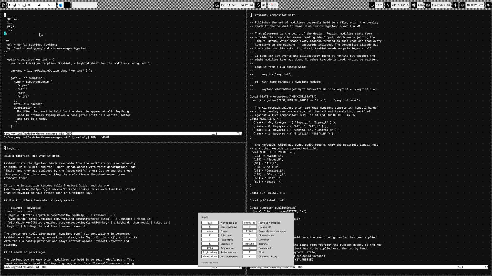

# keyhint

Hold a modifier, see what it does.

keyhint lists the Hyprland binds reachable from the modifiers you are currently
holding. Hold `Super` and the `Super` binds appear with their descriptions; add
`Shift` and they are replaced by the `Super+Shift` ones; let go and the sheet
disappears. The binds keep working the whole time — the sheet never takes
keyboard focus.

It is the interaction Windows calls Shortcut Guide, and the one
[which-key.nvim](https://github.com/folke/which-key.nvim) made familiar, except
that it reveals on hold rather than on a trigger key.



Add `Shift` and the sheet is replaced by that layer, folded down to what is
actually different about it:


## How it differs from what already exists

| | trigger | keyboard |
| --- | --- | --- |
| [HyprHelp](https://github.com/Yosh145/HyprHelp) | a keybind | — |
| [hypr-binds](https://github.com/hyprland-community/hypr-binds) | a launcher | takes it |
| [wlr-which-key](https://github.com/MaxVerevkin/wlr-which-key) | a keybind, then modal | takes it |
| keyhint | holding the modifier | never takes it |

The cheatsheet tools also parse `hyprland.conf` for annotations in comments.
keyhint asks the running compositor instead, via `hyprctl binds -j`, so it works
with the Lua config provider and stays correct across `hyprctl keyword` and
reloads.

## It needs no privileges

The obvious way to know which modifiers are held is to read `/dev/input`. That
requires membership of the `input` group, which lets **every** process running
as you read **every** keystroke on the machine, passwords included. That is a
steep price for a hint overlay.

keyhint instead runs a small Lua file inside Hyprland's own VM and asks the
compositor, which already has the state. It looks at nothing but whether the
eight modifier keys are down; no other keycode is read, stored or published.

## Install

### Flake

```nix
{
  inputs.keyhint.url = "github:R3D2/keyhint";

  # In your home-manager configuration:
  imports = [ inputs.keyhint.homeModules.default ];
  nixpkgs.overlays = [ inputs.keyhint.overlays.default ];

  services.keyhint.enable = true;
}
```

The module reads its default package from `pkgs.keyhint`, so either apply the
overlay as above or set `services.keyhint.package` yourself.

With `wayland.windowManager.hyprland` enabled and `configType = "lua"`, the
module wires up both halves. Otherwise it installs the overlay and tells you
the one line to add to your Hyprland config.

### Without a flake

```
nix-build -E 'with import <nixpkgs> {}; callPackage ./package.nix {}'
```

Then load the Lua half from your Hyprland config:

```lua
require("keyhint")   -- after copying share/keyhint/keyhint.lua next to it
```

and run `keyhint` from your session.

## Binds need descriptions

keyhint shows a bind only if it has a description, because a dispatcher and its
arguments are not an explanation. With the Lua provider:

```lua
hl.bind("SUPER + Return", hl.dsp.exec_cmd("kitty"), { description = "Terminal" })
```

With `hyprland.conf`, use `bindd`:

```
bindd = SUPER, Return, Terminal, exec, kitty
```

Either way the text comes back out of `hyprctl binds -j`, which is what keyhint
reads.

## Options

All of these are `services.keyhint.*`, and each maps to a command-line flag if
you are running it yourself (`keyhint --help`).

| Option | Default | Meaning |
| --- | --- | --- |
| `gate` | `super` | modifier that must be held for the sheet to appear |
| `delay` | `200` | milliseconds to hold before it appears |
| `rowsPerColumn` | `13` | binds down a column before wrapping |
| `anchor` | `center` | `center`, `top` or `bottom` |
| `margin` | `48` | pixels from the anchored edge |
| `opacity` | `1.0` | opacity of the sheet, 0.0 to 1.0 |
| `fold` | `true` | fold runs of near-identical binds into one row |
| `style` | `""` | CSS appended to the built-in stylesheet |

If you hold the gate modifier to drag windows, consider
`anchor = "bottom"`: a centred sheet lands on top of whatever is being dragged.

Style hooks are `keyhint-sheet`, `keyhint-title`, `keyhint-key`,
`keyhint-description`, `keyhint-footer` and `keyhint-empty`.

### Folding

Ten binds that say `Workspace 1` through `Workspace 10` teach nothing the
first one did not, so runs of three or more are folded into a single row:
`1…0  Workspace 1-10`, and `←↑↓→  Move window` for the four directions. A run
is detected by a description ending in a number or a direction word.

It costs a little precision -- the folded row implies that `0` is workspace 10
rather than saying so -- so `fold = false` gives the unabridged list. Column
balancing and the footer are not affected: `rowsPerColumn` is a maximum rather
than a target, and the columns are levelled once their number is known.

## Notes from building it

Three things about Hyprland binds are worth writing down, because each one
looks like a working design until it is measured. All were checked against
0.56.2 with synthetic key events.

1. **A `release` bind on a modifier is suppressed if any other bind fired while
   it was held.** This is deliberate — it is what stops a tap-to-launch bind
   firing after `Super+Return` — but it means "hide on release" strands the
   sheet on screen after any real use.
2. **Autorepeat gives roughly twenty events a second while a modifier is held,
   but the repeat belongs to the last key pressed.** Press `Shift` while
   holding `Super` and the `Super` repeat stops for good, even after `Shift`
   comes back up. A heartbeat built on it dies silently.
3. **`hl.is_key_down` reports the state from before the event being handled,**
   so the key that triggered the callback has to be applied over the top by
   hand.

What survives is a design with no binds at all: one subscription to
`input.keyboard.key`, which fires on both press and release.

## Licence

MIT.
